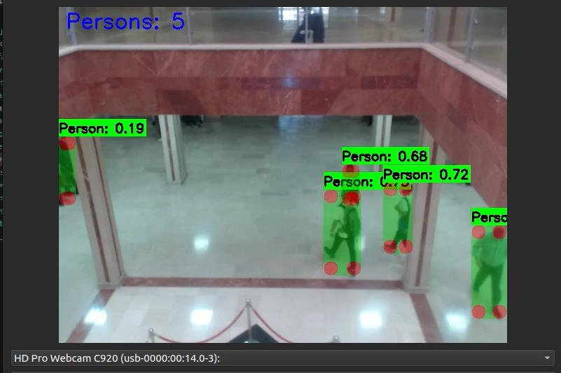
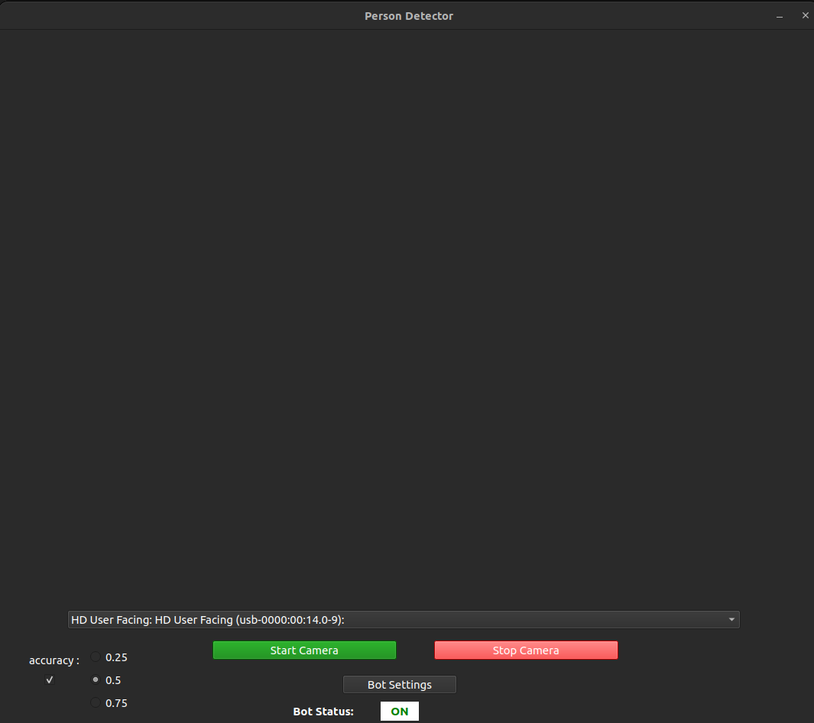
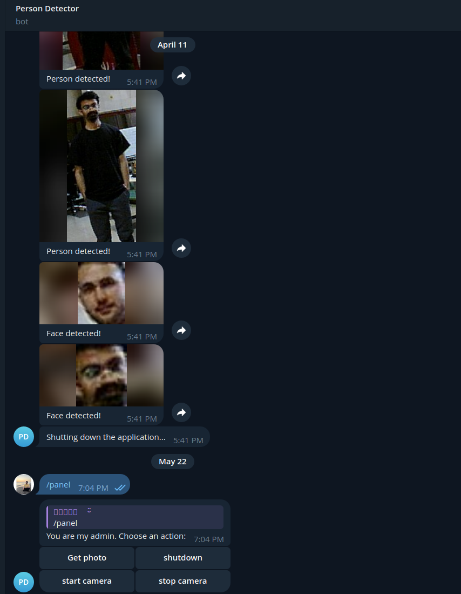

# Person Detection System with PyQt and YOLO

## Overview
A robust desktop application built with PyQt6 that leverages YOLO object detection to identify and track people in video streams. This project combines computer vision capabilities with a user-friendly interface for real-time person detection and works both offline and online.

> Currently works on Unix-based systems, with Windows compatibility planned for future releases.

## Project Structure

The project follows a modular Python package structure for better maintainability and extensibility:

```
person-detection-PyQt-yolo/
├── src/
│   └── person_detection/          # Main package
│       ├── __init__.py
│       ├── main.py               # Application entry point
│       ├── core/                 # Core functionality
│       │   ├── config.py         # Configuration settings
│       │   └── models.py         # YOLO model management
│       ├── detection/            # Detection logic
│       │   ├── detector.py       # Person detection algorithms
│       │   └── camera.py         # Camera management
│       ├── ui/                   # User interface
│       │   ├── main_window.py    # Main application window
│       │   └── video_thread.py   # Video processing thread
│       ├── telegram/             # Telegram bot integration
│       │   └── bot.py            # Bot functionality
│       └── database/             # Database operations
│           └── handler.py        # Database management
├── run.py                        # Compatibility script
├── setup.py                      # Package installation
├── requirements.txt              # Dependencies
└── README.md                     # This file
```

## Installation

### Method 1: Direct Installation (Recommended)
```bash
# Clone the repository
git clone https://github.com/Erfan-ram/person-detection-PyQt-yolo.git
cd person-detection-PyQt-yolo

# Install system dependencies
sudo apt install v4l-utils

# Install Python dependencies
pip install -r requirements.txt

# Install the package
pip install -e .

# Run the application
person-detection
```

### Method 2: Run Directly
```bash
# After cloning and installing dependencies
python run.py
```

### Method 3: Development Mode
```bash
# From the project root
python -m src.person_detection.main
```

## Screenshots

<div align="center">
    
    <p><em>Person Detection in Action</em></p>
</div>

<div align="center">
    
    
    <br>
    <p><em>Application Interface &nbsp;&nbsp;&nbsp;&nbsp;&nbsp;&nbsp;&nbsp;&nbsp;&nbsp;&nbsp;&nbsp;&nbsp;&nbsp;&nbsp;&nbsp;&nbsp;&nbsp;&nbsp;&nbsp;&nbsp;&nbsp;&nbsp;&nbsp;&nbsp;&nbsp;&nbsp;&nbsp;&nbsp;&nbsp;&nbsp;&nbsp;&nbsp;&nbsp;&nbsp;&nbsp;&nbsp;&nbsp;&nbsp;&nbsp;&nbsp;&nbsp;&nbsp;&nbsp;&nbsp;&nbsp;&nbsp;&nbsp;&nbsp;&nbsp;&nbsp;&nbsp;&nbsp; Detection Results on Telegram</em></p>
</div>


## Features
- [x] Real-time person detection in video streams
- [x] Video source selection ( webcams )
- [x] Detection visualization with bounding boxes
- [x] Security monitoring
- [x] Telegram Bot alert system
- [x] User-friendly PyQt6 interface
- [x] Compatible with Raspberry Pi for edge computing applications

## Technology Stack
- **GUI**: PyQt6
- **Computer Vision**: OpenCV, YOLO v8
- **Camera Utilities**: v4l-utils

## Prerequisites
Before using this application, you need to install v4l-utils:
```bash
sudo apt install v4l-utils
```
This utility is used to identify and configure camera devices in the system.

## Dependencies
All Python dependencies are listed in `requirements.txt` and will be installed automatically with the installation methods above.

## Future Roadmap
### Planned Features
- [x] Multiple detection confidence levels (High, Medium, Low)
- [ ] Add facial recognition capability to identify unique individuals and track their presence over time
- [ ] Generate detailed statistics and reports for each identified person
- [ ] Full support for Windows operating systems
- [ ] Upgrade to newer YOLO versions for improved accuracy and performance
- [ ] Simultaneous monitoring from multiple camera sources
- [ ] Backup detection logs and statistics to cloud services
- [ ] Customizable notification rules based on person count, time of day, or specific individuals
- [ ] Database integration for persistent storage